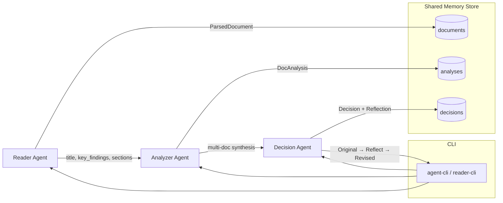

# Agent Pipeline
**Reader → Analyzer → Decision (with Reflection & Shared Memory)**

A multi-agent document processing framework. It ingests plain-text/Markdown documents, extracts structure and metadata, performs higher‑level analysis (such as themes, entities, contradictions, sentiment, risks), and answers global questions across a corpus. The Decision Agent includes a **reflection loop** that revisits and improves its own conclusions for traceability and quality.

---

## Key Features

- **Reader Agent**
  - Parses `.txt`/`.md`, normalizes content, removes front‑matter/HTML, splits sections, heuristically extracts key findings and tone/category.
  - Optional **LLM refinement** via OpenAI‑compatible JSON responses.
- **Analyzer Agent**
  - Extracts **themes, entities, sentiment, patterns, contradictions, critical issues, and follow‑up questions**.
  - Pluggable: heuristic/offline mode or LLM‑assisted mode.
- **Decision Agent**
  - Synthesizes findings **across the corpus**; produces an answer with rationale, evidence, and confidence.
  - **Reflection Mode**: emits **original answer → reflection statement → revised answer**, all logged for auditability.
- **Shared Memory Store**
  - JSON/SQLite backends (JSON default) to persist documents, analyses, and decisions.
- **CLI tools**
  - `agent-cli` (full pipeline/orchestration) and `reader-cli` (reader only).
- **DX & QA**
  - Tests (pytest), lint (ruff), format (black), types (mypy), optional CI template.
- **Resilience**
  - Throttling (`--sleep/--jitter`) between docs + optional exponential backoff for LLM calls.

---

## Architecture



### Data Models (simplified)

- **ParsedDocument**: `{ id, path, tokens, meta{ title, key_findings[], tone, category }, sections{hdr: text} }`
- **DocAnalysis**: `{ themes[], entities[], sentiment, patterns[], contradictions[], critical_issues[], follow_up_questions[], error? }`
- **Decision**: `{ answer, rationale, citations[], supporting_evidence[], confidence, error?, reflection{ original_answer, reflection_statement, final_revised_answer } }`

---

## Project Layout

```
agents/
  cli.py                      # agent-cli entrypoint
  reader_agent.py             # ReaderAgent + _cli for reader-cli
  analyzer_agent_openai.py    # Analyzer (heuristics + OpenAI-compatible mode)
  decision_agent.py           # Global Q&A + reflection loop

core/
  memory_store.py             # JSON/SQLite store

docs/                         # Input .txt/.md files
tests/                        # Offline tests (pytest)
.env                          # OPENAI_* (optional)
pyproject.toml                # packaging & dev tooling
README.md                     # this file
```

---

## Installation

### Prerequisites
- Python **3.10+**
- (Optional) OpenAI‑compatible endpoint

### Steps


```bash
python -m venv .venv
# Windows
. .venv/Scripts/activate
# macOS/Linux
# source .venv/bin/activate

pip install -e .[dev]
```

> Editable install exposes `agent-cli` and `reader-cli` globally in your virtual environment.

---

## Configuration

Create a `.env` in the repository root if you plan to use LLM mode:

```dotenv
OPENAI_API_KEY=your_key
OPENAI_BASE_URL=https://your-endpoint/
OPENAI_MODEL=gpt-4.1-mini
OPENAI_TIMEOUT=60

# Store (optional; defaults shown)
MEMORY_BACKEND=json        # json|sqlite
MEMORY_PATH=.cache/store   # folder for JSON or path to SQLite file
```

**Note:** If your endpoint rate-limits or geo‑blocks, run in `--offline` mode or set throttling flags.

---

## Usage

### Prepare Input
Place your documents in `docs/`:
```
docs/
  Medical_sample1.txt
  Medical_sample2.txt
  ...
```

### Reader only
```bash
reader-cli docs/Medical_sample1.txt --json
```

### Full corpus (offline) with reflection
```bash
agent-cli --offline --reflect \
  --global-q "Where are the biggest risks and contradictions across the corpus?" \
  --global-plain
```

### Full corpus with LLM (if configured)
```bash
agent-cli --reflect \
  --global-q "What should we prioritize next and why?" \
  --global-plain
```

### Per-document Q&A
```bash
agent-cli --offline \
  --q "What are the top 3 action items for this document and why?"
```

### Throttling (avoid 429)
```bash
# Sleep 2s between docs with ±0.5s jitter
agent-cli --offline --reflect --sleep 2 --jitter 0.5 \
  --global-q "Where are the biggest risks and contradictions across the corpus?" \
  --global-plain
```

---

## Reflection Mode (Decision Agent)

When `--reflect` is enabled the Decision Agent will:
1. Produce an **original answer** for the global question.
2. Generate a **reflection statement** (e.g., “I may have underweighted the SLO contradiction across services…”).
3. Output a **final revised answer** that integrates the reflection.

All three are persisted in the store and emitted to stdout for auditability and reproducibility.

**Design goals**
- Encourage self‑critique on missing evidence, misweighting, or contradicting signals.
- Provide a transparent reasoning loop (pre/post reflection comparison).
- Preserve artifacts for later evaluation (A/B or human review).

---

## CLI Reference

`reader-cli` (from `agents.reader_agent:_cli`)
```
reader-cli PATH [--json] [--use-llm]

PATH        Path to .txt or .md
--json      Print full ParsedDocument JSON
--use-llm   Use OpenAI-compatible LLM for meta extraction
```

`agent-cli` (from `agents.cli:main`)
```
agent-cli [--offline] [--reflect]
          [--q QUESTION] [--global-q QUESTION] [--global-plain]
          [--sleep SECONDS] [--jitter SECONDS]

--offline        Disable network calls (heuristics only)
--reflect        Enable reflection loop in the Decision Agent
--q              Ask a per-document question (prints alongside each doc)
--global-q       Ask a single question across the entire corpus
--global-plain   Print a concise/plain global answer
--sleep          Fixed delay between docs (throttling)
--jitter         ±random jitter (in seconds) added to --sleep
```

---

## Development

### Quality Tooling
```bash
# Lint (report issues)
ruff check .

# Lint + auto-fix
ruff check . --fix

# Format
black .

# Type-check
mypy agents core data_store main.py tests

# Tests
pytest -q
```
---

##  Resilience & Rate Limiting

- **Between-doc throttling**: `--sleep` and `--jitter` flags.
- **Offline mode**: deterministic heuristics; ideal for CI or blocked endpoints.

---

## Troubleshooting

- **`ModuleNotFoundError: main` when running `agent-cli`**  
  Ensure console script target is `agents.cli:main` and you’ve reinstalled with `pip install -e .[dev]`.

- **LLM calls return 403/429**  
  Use `--offline` or throttle with `--sleep`/`--jitter`. Confirm `.env` is set and endpoint allows your IP/region.

- **Tests don’t collect**  
  Pytest collects `tests/test_*.py`; ensure file names match. Place path adjustments in `tests/conftest.py`.

- **Case sensitivity on imports**  
  Keep packages **lowercase** (`agents/`, `core/`). Mixed case may work on Windows but break elsewhere.

---

## Roadmap

- Pluggable analyzers (transformers/onnx).
- More storage backends (Postgres/Vector DB).
- Rich HTML/Markdown report generation.
- Confidence calibration & evaluation harness.
- Streaming logs/metrics with structured logging.

---

